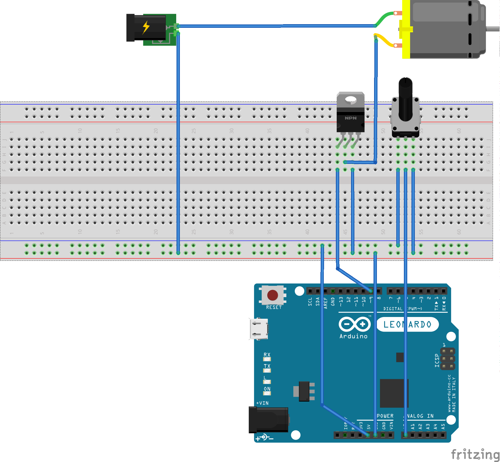

# EllieSpeed
Data logging plugin for 
to store data for post-analysis or to display/use in real time

## Overview
### Architecture

 

* data output plugin for _GP Bikes_
* telemetry data is broadcast via UDP
* UDP receivers for:
  * data logger to a _SQLite_ file for archival and post-analysis
  * _Arduino_ receiver to drive a tachometer

### Driving a physical tachometer in real time

 

* _Arduino_ connected to host PC via serial COM port
  * receives byte (0-255) for RPM reading
  * uses PWM to set needle position on physical tachometer
  * _Arduino_ is 5V but tachometer is 12V, so use a transistor
  * potentiometer is shown for testing purposes only

## Requirements

### Build Time

To compile the project, you will need:
  * Visual Studio 2019 Professional
    * C# desktop development
    * .NET Framework 4
    * C++/CLI development
  * SQLite data provider for .NET Framework 4
  * write access to:
    `C:\Program Files (x86)\GP Bikes\gpbikes\plugins\`

### Run Time

To run the project, you will need:
  * GP Bikes
  * .NET Framework 4
  * SQLite data provider for .NET Framework 4

## Known Issues
* configuration is, err, fiddly and obfuscated - sorry
* http://system.data.sqlite.org/index.html/artifact/96f3932f9f371cca